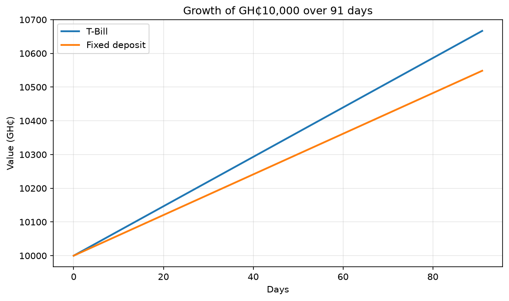

# Ghana T-Bill Calculator


*Growth of GH₵10,000 over 91 days: T-Bill vs fixed deposit.*

A Python command-line tool that compares investing in a Ghana Treasury Bill against a fixed deposit, so you can see which gives more money at maturity.

## Features

- Calculates the T-Bill price and equivalent interest rate from the discount rate
- Calculates maturity value for a T-Bill and a fixed deposit
- Compares the two and shows the winner
- Generates a growth chart showing how each option grows over time
- Input validation, so bad entries don't crash the program

## How to run

1. Install [Python 3](https://www.python.org/downloads/)
2. Clone this repo:
```
   git clone https://github.com/ClaudiaLarety/ghana-tbill-calculator.git
   cd ghana-tbill-calculator
```
3. Run the calculator:
   - Windows: `py tbill.py`
   - Mac/Linux: `python3 tbill.py`
4. (Optional) Generate the growth chart:
```
   pip install matplotlib
   py chart.py
```
   Use `python3 chart.py` on Mac/Linux.

## Example

Investing GH₵10,000 for 91 days, with a 25% T-Bill discount rate and a 22% fixed deposit rate:

```
T-Bill value:        GH₵10,666.67
Fixed deposit value: GH₵10,548.49
Winner: T-Bill by GH₵118.18
```

## How it works

- T-Bill price = 100 × (1 − discount rate × days / 364)
- Fixed deposit value = amount × (1 + rate × days / 365)

## Notes

- Rates are entered by the user, not fetched live.
- Does not account for taxes, fees, or compounding.

## Roadmap

- Support for different T-Bill tenors side by side

## Author

Claudia Lartey ([GitHub](https://github.com/ClaudiaLarety))
